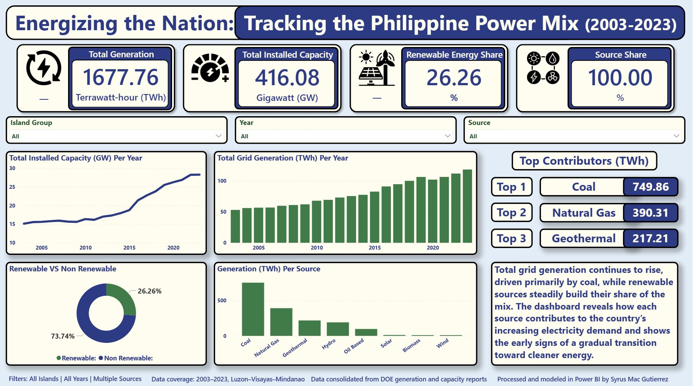

# 📊 PH Energy Dashboard (2003–2023)

#### Analysis of 21 years of power generation and installed capacity in the Philippines using DOE data, transformed into an interactive Power BI dashboard.

  

---

## Overview
This project examines long-term energy patterns across Luzon, Visayas, and Mindanao from 2003–2023.  
The goal is to turn raw DOE data into meaningful insights through structured cleaning, modeling, and visualization.

---

## 📌 Dashboard & Materials
- **Live Dashboard**  
  [Open Dashboard](https://app.powerbi.com/view?r=eyJrIjoiODdjNDQwYTYtZTI0NS00ZmZhLWJkM2QtYTQ3ZmQ1YjFiZDM0IiwidCI6IjUyZGE4ZmY4LWZlZDktNDZjNC04YjlmLWI1ODU4OTJhMTQ0NiIsImMiOjEwfQ%3D%3D)

- **Presentation Slides**  
  [View Slides](https://docs.google.com/presentation/d/e/2PACX-1vSMuDTqxs-qmBe1THsObyC2muMvghiRe2vnaqgbT_44PpVm5BAyV1gwmN8jxNFwgYd0XbFXJM2zB5Ct/pub?start=false&loop=false&delayms=60000&slide=id.p1)

---

## Objectives
- Analyze long-term generation trends in TWh  
- Compare fossil fuels vs renewable sources  
- Assess growth of installed capacity versus demand  
- Build an interactive dashboard for exploration  
- Strengthen skills in modeling, DAX, and data storytelling  

---

## 📈 Key Insights
- Total grid generation **more than doubled** (early 2000s → 118 TWh in 2023)  
- **Coal is still the dominant source**, especially in Luzon  
- **Renewables grew steadily**, led by hydro & geothermal  
- **Solar accelerated after 2015** (though still small overall)  
- **Generation grew faster than capacity**, signaling future supply pressure  
- **Regional differences**  
  - Luzon → fossil-fuel heavy  
  - Visayas → geothermal strong  
  - Mindanao → hydro dependent  

---

## Methodology
- Cleaned DOE data via Power Query  
- Normalized structure through unpivoting  
- Built DAX measures for % share, YoY, and KPIs  
- Standardized units to TWh  
- Designed dashboard layout with muted palette  
- Verified calculations against raw totals  

---

## 📁 Repository Structure
ph-energy-dashboard/

── cleaned_data/

     └── Power Generation Cleaned.xlsx

     └── Installed Capacity Cleaned.xlsx

── dashboard/

     └── Dashboard_Screenshots
     
── presentation/

    └── PH_Energy_Analysis_Presentation.pdf

── README.md

---

## Limitations
- No emissions or cost data included  
- Dependent on DOE reporting format  
- No forecasting or policy modeling  
- No plant-level granularity  

---

## 👨‍💻 Skills Demonstrated
Power BI • DAX • Power Query • Data Cleaning • Data Modeling • Exploratory Analysis • Visualization • Git/GitHub

---

## 📝 About This Project
This is my first major analytics project as I transition into data analytics.  
It reflects the foundation I'm building in modeling, dashboarding, and transforming public datasets into actionable insights.

