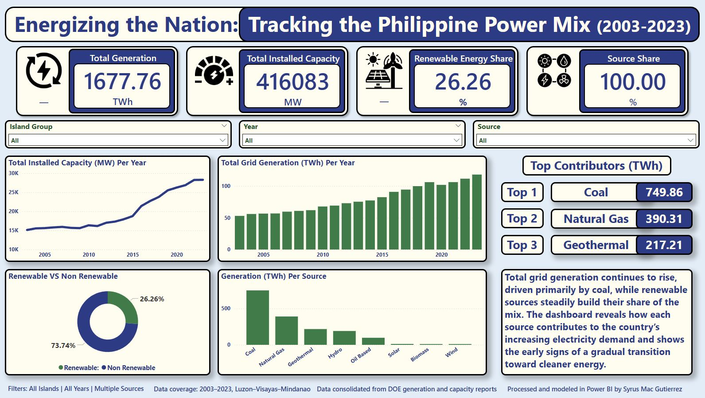

# **Philippine Power Generation & Capacity Dashboard (2003–2023)**
### 📊 **A full Power BI analytics project on generation, capacity, and renewable energy trends in the Philippines.**

  

### **Live Dashboard**
[Click here to explore the fully interactive Power BI report](https://app.powerbi.com/view?r=eyJrIjoiNDI1YjE2MmUtM2FkNC00YzRlLWJhMzgtNmM1NTM3ZjE3YjA3IiwidCI6IjUyZGE4ZmY4LWZlZDktNDZjNC04YjlmLWI1ODU4OTJhMTQ0NiIsImMiOjEwfQ%3D%3D)

### **Project Overview**

This project analyzes 20 years of historical data (2003–2023) from DOE generation and capacity reports to understand how the Philippine energy mix has evolved.
It highlights:
* Total grid generation growth
* Installed capacity expansion
* Renewable vs. non-renewable distribution
* Top energy contributors
* Island group and year-level dynamics

The result is an interactive dashboard that gives users clear visibility on how the country’s power mix has changed over time — and where it is heading.

### **Presentation Slides**
[Click here to explore the complete project story](https://docs.google.com/presentation/d/e/2PACX-1vSMuDTqxs-qmBe1THsObyC2muMvghiRe2vnaqgbT_44PpVm5BAyV1gwmN8jxNFwgYd0XbFXJM2zB5Ct/pub?start=false&loop=false&delayms=60000)

### **Data Sets**
* [**Clean Power Generation Data Set**](./Power%20Generation%20Cleaned.xlsx)
* [**Clean Installed Capacity Data Set**](./Installed%20Capacity%20Cleaned.xlsx)

### **Tools Used**
* Power BI	 - Dashboard development & modeling
* Excel	- Initial data cleaning
* DAX	- For Measures, YoY, and dynamic KPIs

### 🧠 **About This Project**

This is the first project in my portfolio as I transition into data analytics.
It reflects the full workflow, from raw data to a polished dashboard and serves as a foundation for more complex projects involving business, operations, and real-world analytics.

#### Author
Syrus Mac Gutierrez

Data Analyst in training 

📧 Email: syrus.mac19@gmail.com

🔗 GitHub: https://github.com/syrusgutierrez
